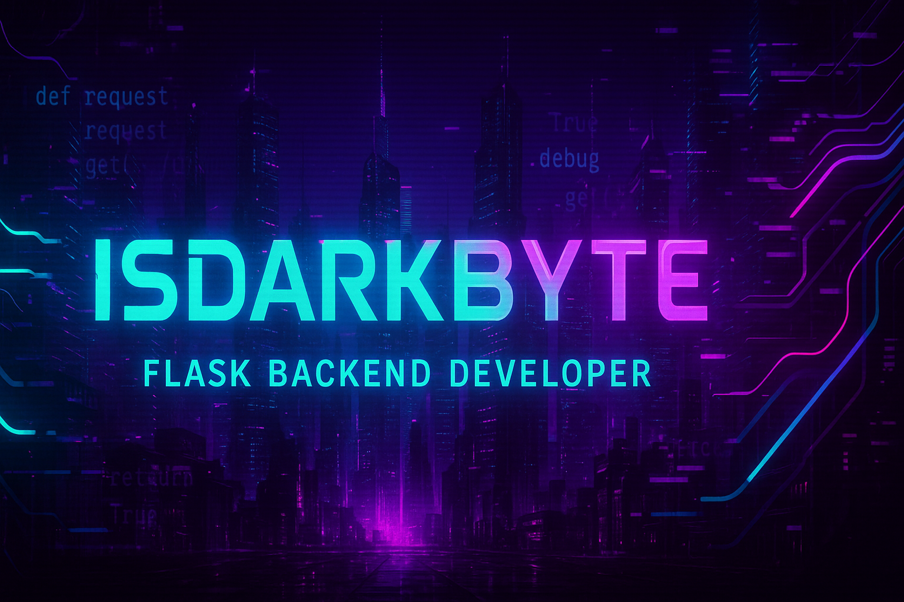

# 🧠 FlaskProjectPersonalBusinessCard

<p align="center">
  
</p>

<p align="center">
  <b>IsDarkByte</b><br/>
  <i>Python backend developer • Cyberpunk-inspired projects • Conscious engineering</i>
</p>

---

🌐 **Личный сайт-визитка на Flask**  
🚀 A personal cyberpunk-style business card site built with Flask.

---

## 🇷🇺 Описание проекта

Минималистичная визитка backend-разработчика на Flask:

- 🧠 Главная страница с информацией
- 🚀 Раздел с проектами (подгрузка с GitHub API)
- 📬 Контакты и сертификат
- 🌗 Переключение темы (тёмная / светлая)
- 🔌 Подготовка к REST API (в будущем)
- 🧪 Автоматическое тестирование через GitHub Actions

### 🔧 Стек технологий:
`Python • Flask • Jinja2 • HTML • CSS • Git • GitHub Actions`

---

## 🇺🇸 Project Description

A minimalist cyberpunk-style personal website built with Flask:

- 🧠 Main page with developer bio
- 🚀 Projects section with GitHub integration
- 📬 Contact info and certificate
- 🌗 Dark/light theme toggle
- 🔌 REST API planned
- 🧪 Automated testing via GitHub Actions

---

## 🚀 Deploy to Render

Нажми на кнопку ниже, чтобы развернуть проект в облаке:  
Click the button below to deploy on Render:

[](https://render.com/deploy)

> ⚠️ Убедитесь, что у вас есть `render.yaml`, `requirements.txt` и `app.py` в вашем корневом каталоге.
> 
> ⚠️  Make sure you have a `render.yaml`, `requirements.txt` and `app.py` in your root directory.

---

## 🧪 Как запустить локально / How to run locally

```bash
git clone https://github.com/IsDarkByte/FlaskProjectPersonalBusinessCard.git
cd FlaskProjectPersonalBusinessCard
python -m venv .venv
.venv\Scripts\activate  # (на Windows)
pip install -r requirements.txt
python run.py
```

📬 Контакты / Contacts

GitHub: IsDarkByte

Telegram: @IsDarkByte

## 📄 License

Этот проект лицензирован по [MIT License](LICENSE).

This project is licensed under the [MIT License](LICENSE).

